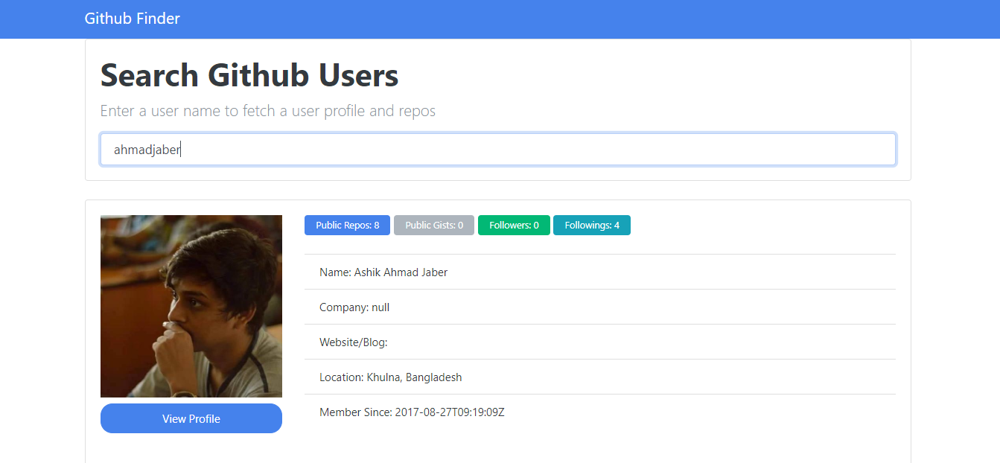

# Github-Finder

## Which uses the Github API to find github user and there Informations.

## And also there last 5 repository.

## This is an application build with Vanilla JavaScript.Object Oriented Javascript.

    ## Async-Await has been used to fetch data from API

